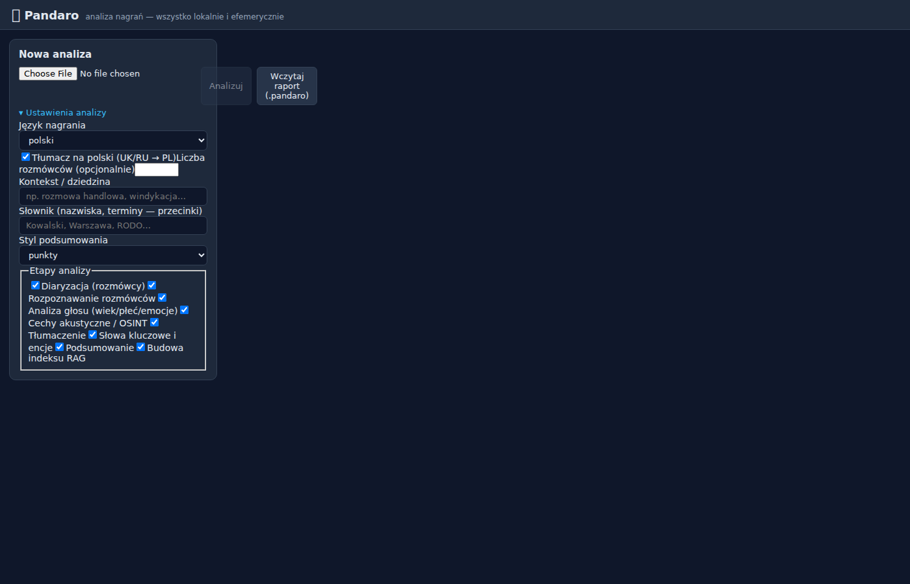

# 🐼 Pandaro

**Lokalne, efemeryczne narzędzie do analizy nagrań rozmów i spotkań** (telefon,
meeting). Transkrypcja (Whisper large‑v3), diaryzacja rozmówców, analiza głosu
(wiek / płeć / emocje), cechy akustyczne / OSINT, słowa kluczowe i encje,
tłumaczenie (UK/RU → PL), hierarchiczne podsumowanie oraz **hybrydowy RAG**
(odporny na warianty transliteracji cyrylicy) z czatem agenta i interpreterem
kodu Pyodide. Interfejs jest w języku polskim i działa w przeglądarce Chrome na
`http://localhost:9090`.

> **Prywatność / efemeryczność:** stan analizy żyje **wyłącznie w karcie
> przeglądarki**. Zamknięcie karty lub przycisk **„Wyczyść”** kasuje wszystko;
> backend jest bezstanowy i nie przechowuje nagrań ani wyników między
> uruchomieniami (poza pamięcią podręczną modeli).

---

## Zrzuty ekranu



*Ekran startowy — wybór pliku audio, ustawienia analizy, podgląd transkryptu
i panel RAG/Chat.*

---

## Architektura

```
Chrome SPA (po polsku)                         Python backend (FastAPI, GPU, Docker)
 ├─ stan efemeryczny (pamięć karty)             ├─ Orkiestrator faz (re-runnable, streaming)
 ├─ RAG: BM25 + fonetyka + wektory (RRF)        ├─ ASR  (WhisperX / faster-whisper, large-v3)
 ├─ czat agenta + interpreter Pyodide  ──REST/WS─┤─ Diaryzacja (pyannote → NeMo pluggable)
 └─ eksport/import .pandaro                      ├─ Paralingwistyka + akustyka (OSINT)
                                                 ├─ NER / słowa kluczowe / tłumaczenie
                                                 ├─ Proxy embeddingów → Ollama (bge-m3)
                                                 └─ Proxy LLM → Ollama (Gemma 4)
Zewnętrzne: Ollama (host) · HuggingFace (modele, HF_TOKEN, cache)
```

Ciężkie modele ML wymagają GPU, więc backend jest **bezstanowym silnikiem
obliczeniowym**, a przeglądarka jest **jedynym trwałym magazynem sesji**. Indeks
RAG i interpreter kodu działają po stronie klienta (WASM/TS), żeby spełnić
wymóg efemeryczności.

### Fazy potoku (każda osobno uruchamialna ponownie)

`ingest → vad → asr → align → diarize → merge → speaker_id → paralinguistics →
acoustics → translate → keywords → summarize → rag → report`

---

## Wymagania

- **GPU NVIDIA** (zalecane RTX 3090 / 24 GB) + [NVIDIA Container Toolkit](https://docs.nvidia.com/datacenter/cloud-native/container-toolkit/latest/install-guide.html)
- **Docker** + Docker Compose (BuildKit)
- **[Ollama](https://ollama.com/) na hoście** z modelami LLM i embeddingów:
  ```bash
  ollama pull gemma4           # Gemma 4 (automatycznie wykrywa tag, np. gemma4:31b)
  ollama pull bge-m3
  ```
  > Pandaro automatycznie wykrywa rzeczywisty tag modelu na Ollama (np. `gemma4:31b`)
  > na podstawie nazwy bazowej konfiguracji, więc nie musisz ręcznie podawać pełnego tagu.
- **`HF_TOKEN`** z [HuggingFace](https://huggingface.co/settings/tokens) z
  zaakceptowaną licencją modeli `pyannote/speaker-diarization-3.1` i
  `pyannote/segmentation-3.0` (diaryzacja jest gated).

---

## Uruchomienie (Docker — tryb docelowy)

```bash
cp config/.env.example .env          # uzupełnij HF_TOKEN
export HF_TOKEN=hf_...                # używany jako build-secret (nie trafia do warstwy obrazu)
docker compose up --build
```

Otwórz **http://localhost:9090** w Chrome.

- Modele HF są **wstępnie pobierane podczas budowy** (`docker/preload_models.py`)
  i trzymane w wolumenie `pandaro-cache` (`HF_HOME`), więc nie są pobierane
  ponownie przy kolejnych startach/buildach (cache mounts BuildKit + wolumen).
- `HF_TOKEN` jest przekazywany jako **sekret budowania**, nie jest zapisywany w
  żadnej warstwie obrazu.
- Kontener łączy się z **Ollamą na hoście** przez `host.docker.internal:11434`.

### Zarządzanie VRAM (24 GB współdzielone z Ollamą)

Tylko **jeden ciężki model** rezyduje na GPU naraz (blokada GPU + jawny offload
`to('cpu')`/`empty_cache()` między fazami). Ollama jest koordynowana przez
`keep_alive=0`, aby Gemma zwalniała pamięć, gdy potok potrzebuje VRAM na ASR.
Tryb `PANDARO_LOW_VRAM=true` włącza int8 i agresywny offload.

---

## Rozwój lokalny (bez Dockera)

**Backend** (działa też bez GPU — providerzy mają deterministyczne atrapy):

```bash
cd backend
python -m venv .venv && . .venv/bin/activate
pip install -r requirements.txt -e .
PANDARO_ASR_BACKEND=stub python -m pandaro.main      # API na :9090
# testy + lint:
pip install -e ".[dev]" && pytest -q && ruff check .
```

> `PANDARO_ASR_BACKEND=stub` (oraz atrapy diaryzacji/paralingwistyki) pozwalają
> uruchomić **cały potok bez GPU i modeli** — przydatne do dewelopmentu i CI.

**Frontend** (Vite + React + TypeScript, UI po polsku):

```bash
cd frontend
npm install
npm run dev        # http://localhost:5173, proxy /api → :9090
npm run build      # produkcyjny build → frontend/dist (serwowany przez backend)
npm run typecheck  # weryfikacja typów TypeScript
```

---

## Walidacja — testowe nagranie YouTube

Poniższe kroki weryfikują działanie pełnego potoku na nagraniu z YouTube
(polska rozmowa ~2.5h):

```bash
# Instalacja yt-dlp (w środowisku venv)
pip install yt-dlp

# Pobierz nagranie jako WAV (lub tylko fragment 30s do testów)
yt-dlp -x --audio-format wav -o /tmp/nagranie.wav "https://www.youtube.com/watch?v=pYV0Ifx2AGU"
ffmpeg -i /tmp/nagranie.wav -t 30 -y /tmp/test_clip.wav  # fragment 30s

# Uruchom backend z prawdziwym ASR (GPU)
cd backend
PANDARO_ASR_BACKEND=faster-whisper PANDARO_DEVICE=cuda python -m pandaro.main

# Prześlij nagranie przez API
curl -X POST http://localhost:9090/api/sessions \
  -F "file=@/tmp/test_clip.wav" \
  -F 'preset={"translate":false}' | python3 -m json.tool
```

Oczekiwany wynik ASR dla pierwszych 30 sekund (język: `pl`):
```
[4.0s] SPEAKER_01: Halo?
[4.7s] SPEAKER_01: Cześć Danielu!
[6.0s] SPEAKER_00: A cześć Szymek, czy to zaświatów powinien?
...
```

---

## CI / CD

### GitHub Actions

| Workflow | Wyzwalacz | Opis |
|---|---|---|
| **CI** (`.github/workflows/ci.yml`) | push / PR na `main` | Lint (ruff), type-check (tsc), testy backend (40 testów), build frontendu, smoke-test kontenera Docker |
| **Release** (`.github/workflows/release.yml`) | push tagu `v*.*.*` | Build i push obrazu Docker na `ghcr.io`, tworzenie GitHub Release z notatkami |

### Obraz Docker (GitHub Container Registry)

```bash
# Najnowszy stabilny obraz
docker pull ghcr.io/tomasz-sikora/pandaro:latest

# Uruchomienie (wymaga hosta Ollama na porcie 11434)
docker run -d \
  --gpus all \
  -p 9090:9090 \
  --add-host host.docker.internal:host-gateway \
  -e PANDARO_OLLAMA_HOST=http://host.docker.internal:11434 \
  -e HF_TOKEN=$HF_TOKEN \
  -v pandaro-cache:/cache \
  ghcr.io/tomasz-sikora/pandaro:latest
```

### Tworzenie nowej wersji

```bash
git tag v0.2.0
git push origin v0.2.0
# Automatycznie zbuduje i wypchn ie obraz + stworzy GitHub Release
```

---

## Testy

```bash
cd backend
pip install -e ".[dev]"
PANDARO_ASR_BACKEND=stub pytest -q   # 40 testów, ~3s, bez GPU
ruff check .
```

Zestawienie testów:

| Plik | Zakres |
|---|---|
| `tests/test_api.py` | Smoke testy API (sesje, eksport, import, fazy) |
| `tests/test_logic.py` | RRF fusion, cosine ranking, anotacja pewności, chunking |
| `tests/test_text.py` | Transliteracja cyrylicy, normalizacja, fonetyka |
| `tests/test_pipeline.py` | Orchestrator E2E (stub), RAG chunks bez embeddingów |
| `tests/test_integration.py` | Ingest, eksport formatów, potok na prawdziwym WAV (30s clip) |
| `tests/test_ollama_client.py` | Rozwiązywanie nazw modeli Ollama, fallback, cache |

---

## Funkcje kluczowe

- **Precyzja ASR + pewność:** Whisper **large‑v3** (fp16), słowne znaczniki
  czasu i per‑słowo `confidence`; słowa o niskiej pewności są podkreślane i
  klikalne. Podpowiedzi słownika (nazwiska/terminy) z presetu biasują ASR.
- **RAG słowiański:** chunking po turach rozmówców; wyszukiwanie hybrydowe
  (gęste bge‑m3 + BM25 + **fonetyka/transliteracja** Double‑Metaphone‑like)
  łączone przez **RRF**; odpowiedzi agenta cytują fragmenty `[rozmówca, mm:ss]`
  jako dowód, z możliwością przeskoku do nagrania.
- **Auto-detekcja modelu LLM:** konfiguracja `PANDARO_LLM_MODEL=gemma4`
  automatycznie wykrywa rzeczywisty tag (np. `gemma4:31b`) na lokalnym Ollama.
- **Eksport/import `.pandaro`:** pełna sesja (transkrypt, analizy, podsumowania,
  fragmenty + wektory RAG, presety) w jednym pliku; po imporcie nie trzeba
  ponownie uruchamiać potoku. Dodatkowo SRT/VTT/Markdown.
- **Re-run faz:** każdą fazę (np. „Budowa indeksu RAG", „Diaryzacja") można
  uruchomić ponownie z UI.
- **Asystent + Pyodide:** czat z RAG oraz interpreter kodu w przeglądarce do
  dalszej obróbki wyników (np. tabela kto powiedział X, wykres czasu mówienia).

---

## Konfiguracja

Wszystkie ustawienia są sterowane zmiennymi środowiskowymi (prefiks `PANDARO_`).
Pełna lista z opisami: [`config/.env.example`](config/.env.example).

| Zmienna | Domyślnie | Opis |
| --- | --- | --- |
| `PANDARO_LLM_MODEL` | `gemma4` | Model LLM w Ollama (auto-wykrywa tag, np. `gemma4:31b`). |
| `PANDARO_LLM_MODEL_FALLBACK` | `gemma3:27b` | Fallback gdy główny model niedostępny. |
| `PANDARO_EMBEDDING_MODEL` | `bge-m3` | Model embeddingów (RAG). |
| `PANDARO_ASR_MODEL` | `large-v3` | Model Whisper. |
| `PANDARO_ASR_BACKEND` | `faster-whisper` | `faster-whisper` \| `whisperx` \| `stub`. |
| `PANDARO_DEVICE` | `auto` | `auto` \| `cuda` \| `cpu`. |
| `PANDARO_LOW_VRAM` | `false` | int8 + agresywny offload. |
| `HF_TOKEN` | — | Token HuggingFace (modele gated). |

---

## Struktura repozytorium

```
backend/    FastAPI + orkiestrator + providerzy + logika tekstu (testy)
frontend/   SPA (React/TS, po polsku): transkrypt, fala, RAG, czat, eksport
docker/     Dockerfile (multi-stage CUDA) + preload modeli HF
config/     .env.example
docs/       Dokumentacja (zrzuty ekranu, diagramy)
.github/    Workflows CI/CD (ci.yml, release.yml)
compose.yaml
```

## Licencja

Zobacz [LICENSE](LICENSE).

