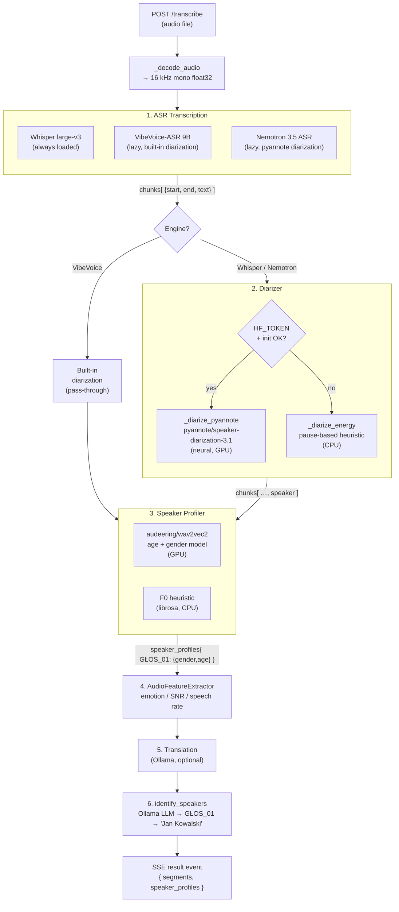

# Speaker Diarization — Architecture & Internals

## Overview

Diarization answers **"who spoke when?"** for each transcribed segment.  
The system has two tiers — a neural pipeline (pyannote) and a fallback heuristic — and integrates with speaker profiling and LLM-based name identification.

---

## Component Map



---

## Diarizer Internals

### Initialisation (`_init` / `_init_pyannote`)

```
Diarizer.__init__()
 │
 ├─ torch.cuda.is_available() → _device = "cuda" | "cpu"
 │
 ├─ HF_TOKEN present?
 │   ├─ No  → _method = "none"  (energy fallback will be used)
 │   └─ Yes → _init_pyannote()
 │               ├─ try Pipeline.from_pretrained(token=…)
 │               ├─ retry with use_auth_token=… (pyannote <3 compat)
 │               ├─ pipeline.to(device)
 │               └─ _method = "pyannote"
 │
 └─ Any exception → _method = "none"
```

### Neural path — overlap-coverage assignment

pyannote returns a set of **turns** `(t_start, t_end, speaker_id)`.  
For every ASR chunk the algorithm accumulates how many seconds of each speaker's turns overlap with the chunk window, then picks the speaker with the highest coverage:

```
chunk [seg_start ─────────────── seg_end]
          │                         │
turn A  ──┤───────────────────┤     │    overlap_A = ...
turn B    │   ┌──────────────────────────┤  overlap_B = ...
          │   │
best = argmax(overlap_A, overlap_B, …)
assign only if best_overlap / seg_dur ≥ 0.05
```

The 5 % threshold filters turns that just barely clip the chunk boundary (noise).  
Raw pyannote speaker labels (`SPEAKER_00`, `SPEAKER_01`, …) are remapped to stable Polish labels `GŁOS_01`, `GŁOS_02`, … in first-seen order.

### Energy heuristic (last resort)

Iterates chunks in order; increments a speaker index (0–5, cycling) whenever the silence gap between consecutive chunks exceeds **1.5 s**.  Always assigns `GŁOS_01` through `GŁOS_06`.

### GPU memory lifecycle

The `Diarizer` participates in the VRAM swap protocol — called by `_offload_all_from_gpu` / `_reload_all_to_gpu` in `main.py` when the heavy VibeVoice model (18 GB) needs to be loaded:

```
VibeVoice request arrives
  → _offload_all_from_gpu()
      → diarizer.to_cpu()   ← moves pyannote pipeline to RAM
      → whisper.unload(), profiler.to_cpu(), …
  → load VibeVoice (~60 s, first time)
  → run VibeVoice (built-in diarization, no Diarizer call)
  → _unload_vibevoice()
  → _reload_all_to_gpu()
      → diarizer.to_gpu()   ← moves back
```

---

## Data Flow — Segment Schema

| Stage | Added fields |
|---|---|
| After ASR | `{start, end, text, words?, language}` |
| After Diarizer | `+ speaker: "GŁOS_01"` |
| After Profiler | speaker_profiles: `{gender, age_estimate, age_group, …}` |
| After Audio features | `+ emotion, speech_rate, snr` |
| After Translation | `+ text_pl` |
| After identify_speakers | speaker_profiles: `+ display_name: "Jan Kowalski"` |

---

## Known Corner Cases & Improvements

### Corner Cases

**1. Overlapping speech**  
pyannote returns non-overlapping turns (it resolves overlaps internally).  
If two people actually speak simultaneously, only one speaker will be credited for the chunk — the one with more cumulative coverage.

**2. Very short chunks (< 0.5 s)**  
The 5 % coverage threshold helps, but short chunks produced by Whisper at sentence boundaries often straddle two turns. The current `max-overlap` rule will attribute the chunk to the dominant speaker; the trailing speaker may be silently dropped.

**3. Long recordings with many speakers**  
pyannote's clustering is global — a recording with 10+ speakers will produce a crowded speaker map, but `GŁOS_NN` labels are assigned in first-seen order, not sorted by speaking time, so speaker numbering is non-deterministic between runs.

**4. Silence-only segments**  
Chunks that fall entirely in silence (between all turns) get `GŁOS_01` as a hard-coded fallback. If `GŁOS_01` has already been mapped to a real name, this silently attributes a nonsense segment to that person.

**5. Energy heuristic with rapid back-and-forth dialogue**  
The 1.5 s pause threshold is too high for conversational speech. Sub-1 s exchanges will never trigger a speaker change, causing all turns to collapse into `GŁOS_01`.

**6. pyannote API version drift**  
The loader tries `token=` then `use_auth_token=` to cope with pyannote 2/3/4 API changes; a future version may add a third kwarg, silently falling back to the energy heuristic.

**7. Temp-file races on high-concurrency**  
`_diarize_pyannote` writes a temp `.wav`, runs the pipeline, then deletes it.  
With `max_workers=1` in the executor this is safe today, but if concurrency is ever raised, two requests could write to the same `tempfile.NamedTemporaryFile` path (unlikely but worth noting).

**8. HF_TOKEN read at import time**  
`HF_TOKEN = os.getenv("HF_TOKEN", "")` is evaluated once at module import.  
If the env var is set after the module is imported (e.g. in tests), the Diarizer will still see an empty token and fall back to the heuristic.

---

### Suggested Improvements

**I1 — Confidence-weighted speaker assignment**  
Instead of the binary 5 % threshold, weight the coverage score by pyannote's
per-turn confidence (available via `annotation.itertracks(yield_label=True)`)
to better handle low-confidence turns near segment boundaries.

**I2 — Silence-segment speaker carry-forward**  
Rather than defaulting silence gaps to `GŁOS_01`, carry forward the last
seen speaker. This is almost always the correct behaviour for natural speech:

```python
# after the coverage block
chunk["speaker"] = chunks[i - 1].get("speaker", "GŁOS_01") if i > 0 else "GŁOS_01"
```

**I3 — Sort `GŁOS_NN` by speaking time**  
After `_diarize_pyannote` builds `speaker_map`, re-sort so that the speaker
with the most total speaking time becomes `GŁOS_01`, making labels
deterministic and meaningful regardless of the first-appearance order.

**I4 — Energy heuristic: use RMS instead of pause gap**  
Replace the crude pause threshold with per-chunk RMS energy windowing to detect actual speaker changes, reducing silent-segment mis-assignments.

**I5 — Lazy HF_TOKEN resolution**  
Read `HF_TOKEN` inside `_init()` rather than at module level so tests and
hot-reloads can inject the token without reimporting the module:

```python
def _init(self):
    hf_token = os.getenv("HF_TOKEN", "")
    if not hf_token:
        ...
```

**I6 — Streaming / chunked diarization for long recordings**  
For recordings > 1 hour the full-audio pyannote run holds a large WAV in RAM.
Consider chunking into 15-min windows with a small overlap and merging speaker
maps (by cosine similarity of pyannote embeddings) to bound memory usage.

**I7 — Expose `num_speakers` hint**  
pyannote accepts `num_speakers=N` to constrain the clustering.  If the frontend
knows the expected number of speakers (e.g. a two-party call) passing it in
can dramatically improve accuracy and speed.

**I8 — Structured error for model-terms not accepted**  
When pyannote raises a 403 / gated-model error the current code logs a generic
message. Detect the specific error and surface a user-readable message via the
SSE stream rather than silently falling back.
